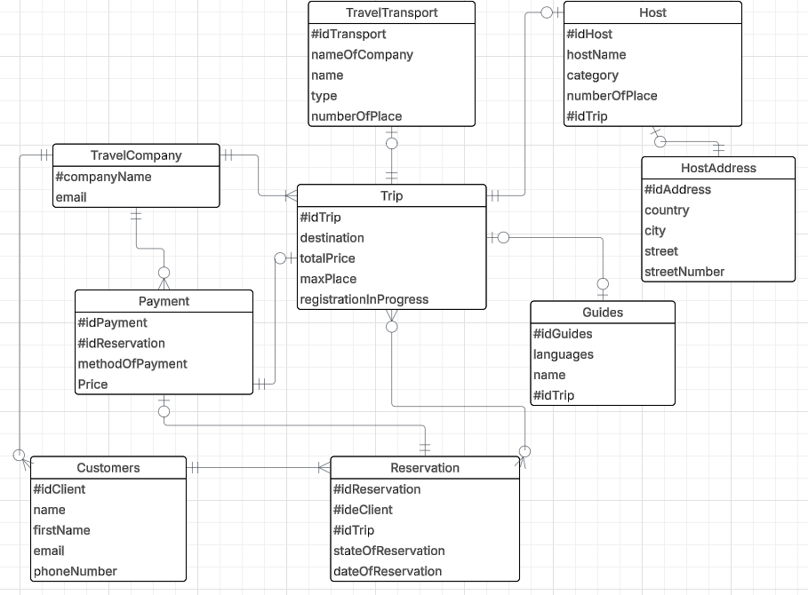
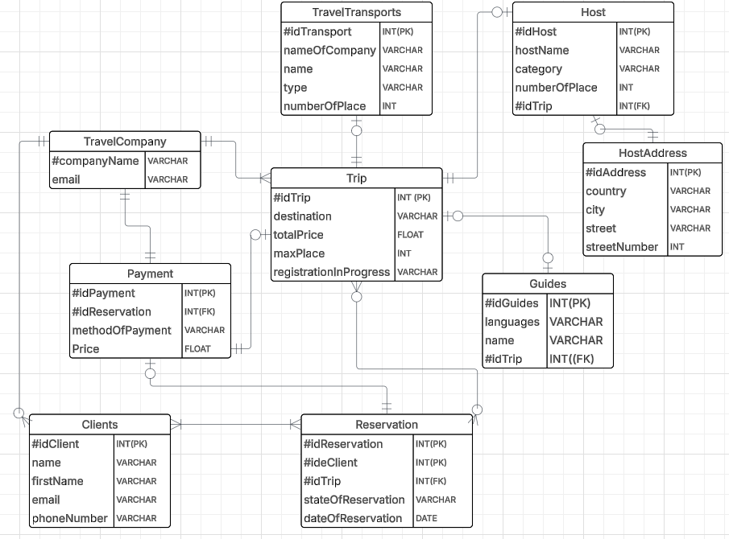

# Modelisation BDD

Some exercise about modelisation and work about Database.

## All the entities and attributes :

- Travel Company :
  - companyName
  - email
- Customers :
  - id client
  - name
  - first name
  - email
  - phone number
- Reservation :
  - id reservation
  - id client
  - id trip
  - state of reservation
  - date of reservation
- Payment :
  - id payment
  - id reservation
  - method of payment
  - price
- Trip :
  - id trip
  - destination
  - total price
  - max place
  - registration in progress
- Travel transport :
  - id transport
  - name of country
  - name
  - type
  - number of place
- Host :
  - id host
  - host name
  - category
  - number of place
  - id trip
- Host address :
  - id address
  - country
  - city
  - street
  - street number
- Guides :
  - id guides
  - languages
  - name
  - id trip

### Schema without type :

### Schema with type :

